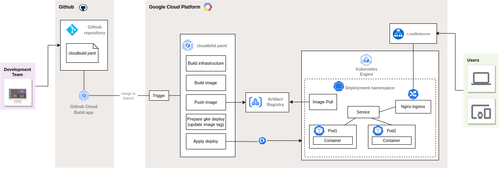

## Deploy the application in GCP

The instruccions in this guide are to setup a Cloud Build trigger that will deploy the infrastructure to deploy the application in GKE.

### Deployment diagram


You can also see it [here](https://viewer.diagrams.net/?tags=%7B%7D&highlight=0000ff&layers=1&nav=1&title=Deploy_to_CloudBuild.drawio#Uhttps%3A%2F%2Fdrive.google.com%2Fuc%3Fid%3D1id8YlLezz0E2yjlMqHaWhVp_lH7lvNns%26export%3Ddownload)

### Prerrequisites

GCP project and a user account with at least Editor role to setup the Cloud Build trigger.

A GCS bucket to store the terraform state and the gke deployment configurations.

Creating the GCS bucket from the [cloudshell](https://cloud.google.com/shell/docs/run-gcloud-commands)
```
PROJECT_ID=$(gcloud config get-value project)

gsutil mb gs://${PROJECT_ID}-tfstate
```
Also enable the object versioning so you can have a history of your deployments
```
gsutil versioning set on gs://${PROJECT_ID}-tfstate
```
 
Have enabled the following APIs in the project 
 + `cloudbuild.googleapis.com`
 + `container.googleapis.com`
 + `compute.googleapis.com`
 + `artifactregistry.googleapis.com`

```
gcloud services enable cloudbuild.googleapis.com \
  container.googleapis.com \
  compute.googleapis.com \
  artifactregistry.googleapis.com
```

Once you have the APIs enabled you will need add the roles to the Cloud Build service account so it can run the cloudbuild jobs to create the infrastructure and access to GKE resources.

The roles needed are:

+ `roles/editor` this role will allow the SA to create the infrastructure
+ `roles/container.admin` this role is used to deploy the manifest to GKE
  
Adding `editor` role to Cloud Build SA
```
CLOUDBUILD_SA="$(gcloud projects describe $PROJECT_ID \
    --format 'value(projectNumber)')@cloudbuild.gserviceaccount.com"

gcloud projects add-iam-policy-binding $PROJECT_ID \
    --member=serviceAccount:$CLOUDBUILD_SA --role roles/editor
```
Adding `container.admin` role to Cloud Build SA
```
gcloud projects add-iam-policy-binding $PROJECT_ID \
    --member=serviceAccount:$CLOUDBUILD_SA --role roles/container.admin
```

### Modify the files to match with your GCP project

In the folder `infra` modify the following files:

+ **`backend.tf`** replace `bucket` with the bucket name created previously
+ **`terraform.tfvars`** replace `project_id` with your GCP project ID
  
Change the following substitution variable in the **`cloudbuild.yaml`** file located in the root 

+ `_OUTPUT_PATH` and add the GCS bucket name created previously

### Connect Github repository to Cloud Build

To use Cloud Build trigger with github, you will need to configure the [Cloud Build app](https://github.com/marketplace/google-cloud-build) and grant this app access to your GitHub account. If you have already installed the app, then you will need to click **Configure access**.

Then, click **Configure** in the Cloud Build app and select the repository you want to connect and then **Save**.

The next step is to sign in with your Google Cloud account. If requested, authorize Cloud Build integration with GitHub.

On the Cloud Build page, a wizard appears In the **Select repository** section, select your GitHub account and the respective repository an click **OK** and **CONNECT**.

Click on **CREATE TRIGGER** this will open the **Create trigger** section and you need to fill the following:

+ Add a trigger name
+ In the **Event** section select **Push to a branch**
+ In the **Source** section, select your Repository and Branch (Example: `^master$` )
+ In the **Configuration** type section select *Cloud Build configuration file*
+ In location add `cloudbuild.yaml` as *Cloud Build configuration file location* and **Save** the trigger configuration.

At this point any change pushed to the branch will trigger the Cloud Build and create the following infrastructure:

+ Artifact registry
+ VPC network, subnetwork and secondary cidr ranges
+ GKE cluster with VPC-native enabled 

Once the Infraestructure is built, the next steps in the flow will

+ Build the image based on the `Dockerfile`
+ Push the image to the Artifact registry
+ Change the deployment with the new image
+ Deploy the manifest to GKE (This include Deployment, HPA, Service and Ingress)
  
### Improvements to be added.
+ Reserve static IP for the LoadBalancer (ingress)
+ Add cert manager to gke
+ Add certificate to ingress
+ Register the DNS name
+ Configure DNS zone and add the relevant records to resolve the app name.


